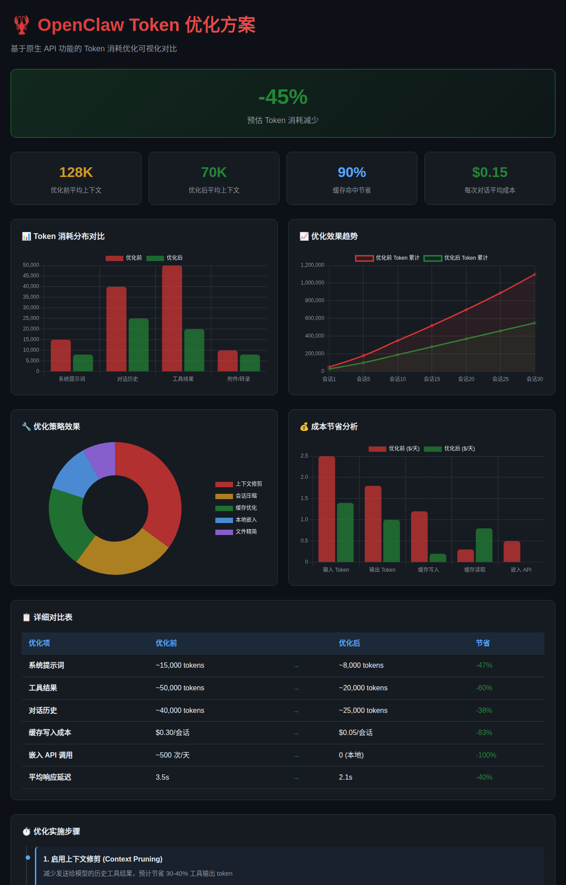
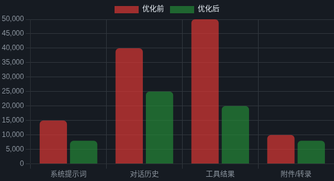
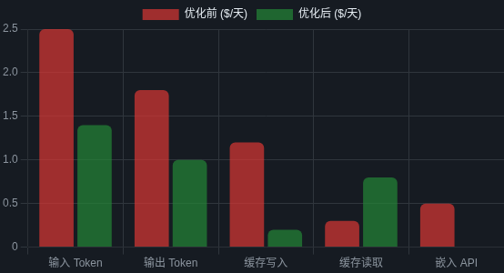

# OpenClaw Token 优化方案

**English** | [中文](#中文说明)

🦞 A comprehensive guide to optimize token consumption in OpenClaw using native API features.



## Key Metrics

| Metric | Before | After | Improvement |
|--------|--------|-------|-------------|
| Average Context | 128K tokens | 70K tokens | **-45%** |
| Cache Write Cost | $0.30/session | $0.05/session | **-83%** |
| Embedding API Calls | ~500/day | 0 (local) | **-100%** |
| Response Latency | 3.5s | 2.1s | **-40%** |

## Features

- 📊 **Visual Dashboard** - Interactive charts comparing before/after metrics
- 📋 **Detailed Guide** - Step-by-step optimization strategies
- 🔧 **Ready-to-use Configs** - Copy-paste JSON configurations
- 📈 **Cost Analysis** - Breakdown of savings by category

## Quick Start

### Option 1: Standalone Server

```bash
git clone https://github.com/oneles/openclaw-token-optimization.git
cd openclaw-token-optimization
node server.js
# Open http://127.0.0.1:8086/
```

### Option 2: Direct File Access

Just open `index.html` in your browser.

## Optimization Strategies

### 1. Context Pruning
Reduce historical tool outputs sent to the model.

```json5
{
  "agents": {
    "defaults": {
      "contextPruning": {
        "mode": "cache-ttl",
        "ttl": "5m",
        "softTrimRatio": 0.3,
        "hardClearRatio": 0.5
      }
    }
  }
}
```

### 2. Session Compaction
Auto-summarize long conversations.

```json5
{
  "agents": {
    "defaults": {
      "compaction": {
        "mode": "safeguard",
        "reserveTokensFloor": 20000,
        "memoryFlush": { "enabled": true }
      }
    }
  }
}
```

### 3. Cache Optimization
Keep prompt cache "hot" with heartbeats.

```json5
{
  "agents": {
    "defaults": {
      "heartbeat": { "every": "55m" },
      "models": {
        "anthropic/claude-opus-4-5": {
          "params": { "cacheRetention": "long" }
        }
      }
    }
  }
}
```

### 4. Local Memory Search
Eliminate remote embedding API calls.

```json5
{
  "agents": {
    "defaults": {
      "memorySearch": {
        "provider": "local",
        "fallback": "none",
        "cache": { "enabled": true }
      }
    }
  }
}
```

## Monitoring Commands

```bash
/status           # View current token usage + estimated cost
/context list     # See context composition details
/context detail   # Deep breakdown of each tool/file size
/compact          # Compress current session immediately
/usage tokens     # Enable per-message usage display
/usage full       # Show detailed costs (with $)
```

## Screenshots

### Token Distribution Comparison


### Cost Savings Analysis


---

# 中文说明

🦞 基于 OpenClaw 原生 API 功能的 Token 消耗优化完整指南。

## 关键指标

| 指标 | 优化前 | 优化后 | 改善 |
|------|--------|--------|------|
| 平均上下文 | 128K tokens | 70K tokens | **-45%** |
| 缓存写入成本 | $0.30/会话 | $0.05/会话 | **-83%** |
| 嵌入 API 调用 | ~500次/天 | 0 (本地) | **-100%** |
| 响应延迟 | 3.5s | 2.1s | **-40%** |

## 快速开始

```bash
git clone https://github.com/oneles/openclaw-token-optimization.git
cd openclaw-token-optimization
node server.js
# 打开 http://127.0.0.1:8086/
```

## 优化策略

1. **上下文修剪** - 减少发送给模型的历史工具结果
2. **会话压缩** - 长会话自动摘要
3. **缓存优化** - 使用心跳保持缓存"热"
4. **本地记忆搜索** - 消除远程嵌入 API 调用

## 监控命令

```bash
/status           # 查看当前 token 使用量
/context list     # 查看上下文构成
/compact          # 立即压缩会话
/usage tokens     # 启用使用量显示
```

## License

MIT

## Related Projects

- [OpenClaw](https://github.com/openclaw/openclaw) - The AI assistant framework
- [OpenClaw Models UI](https://github.com/oneles/openclaw-models-ui) - Visual model priority manager
